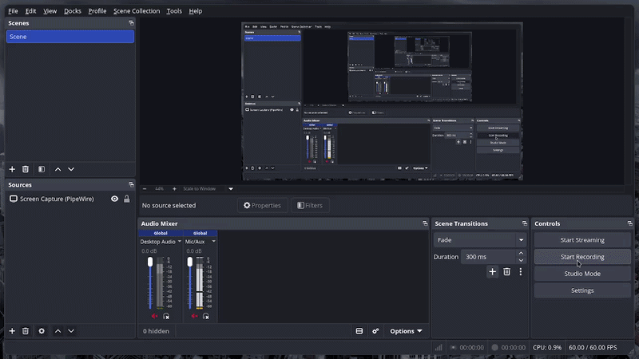
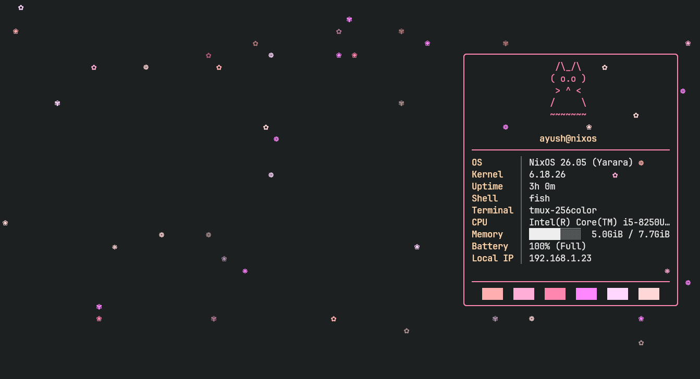
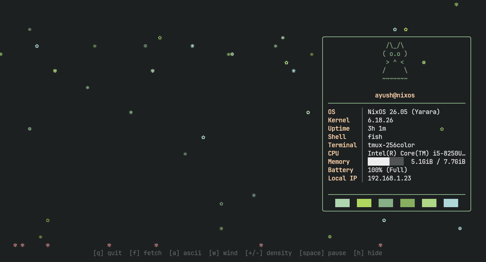
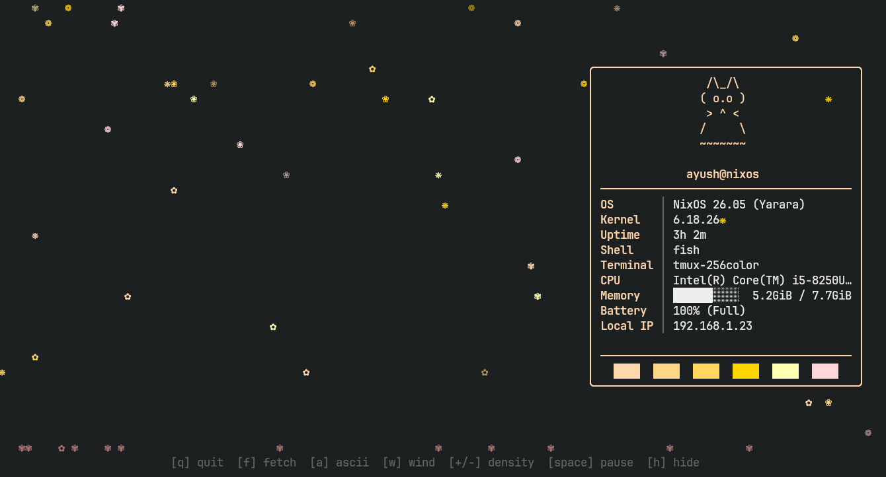
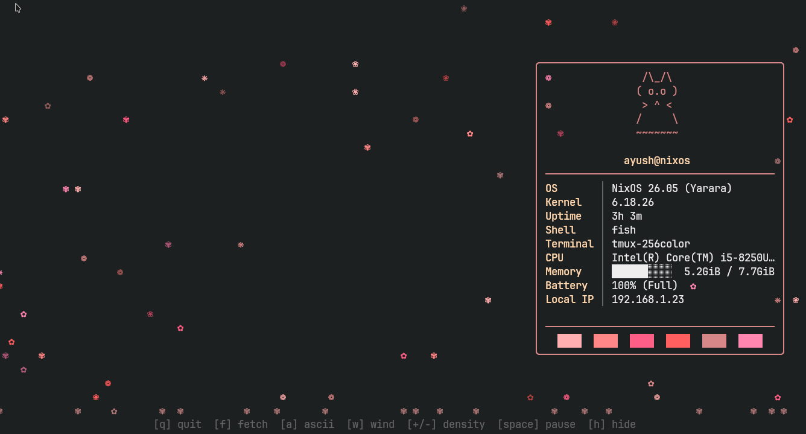
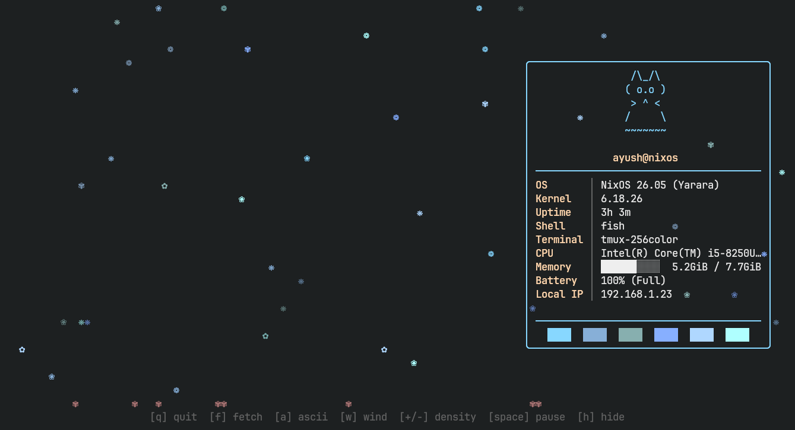
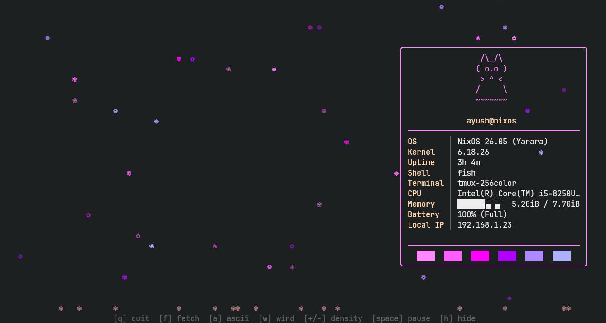

# sakurafetch

falling cherry blossom petals + neofetch-style system info for your terminal



# Install

Requires Python 3.8+. [`psutil`](https://pypi.org/project/psutil) recommended for memory/battery.

### uv (recommended)

```bash
git clone https://github.com/yourusername/sakurafetch
cd sakurafetch
uv tool install .[full]
sakurafetch --fetch
```

Or run directly without installing:

```bash
uv run ./sakura.py --fetch
```

### pip

```bash
pip install .[full]
sakurafetch --fetch
```

### No-install (any platform)

```bash
./sakura.py --fetch
```

# Controls

| Key       | Action                   |
|-----------|--------------------------|
| `q`       | Quit                     |
| `f`       | Toggle system info panel |
| `a`       | Toggle ASCII / unicode   |
| `w`       | Toggle wind              |
| `h`       | Toggle hint bar + ground |
| `+` / `-` | More / fewer petals      |
| `Space`   | Pause                    |

# Themes

| sakura | matcha | sumi |
|--------|--------|------|
|  |  |  |

| rose | ocean | neon |
|------|-------|------|
|  |  |  |

```
sakurafetch --theme <name> --fetch
```

# Options

```
--fetch             Show system info panel
--ascii             Use ASCII petals (no unicode)
--theme <name>      Color theme (sakura, matcha, sumi, rose, ocean, neon)
--density <float>   Petals per column (default 0.55)
--fps <int>         Target framerate (default 30)
--no-wind           Disable wind drift
```

Requires Python 3.8+ and a terminal with unicode support (kitty recommended). `psutil` optional.
